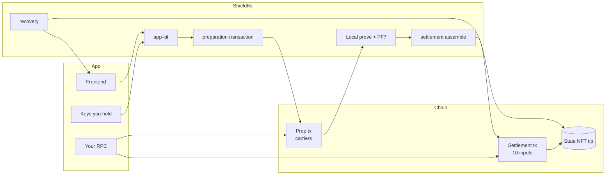
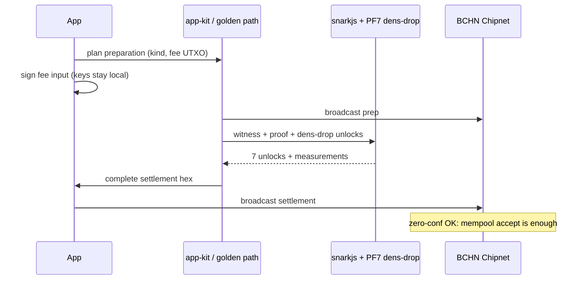
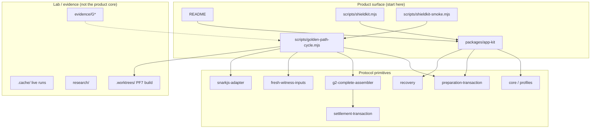
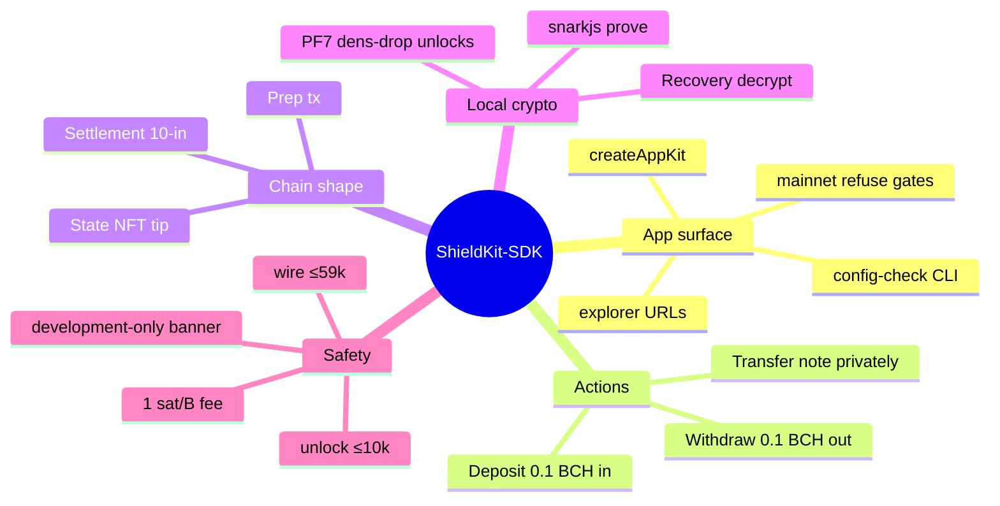

# ShieldKit-SDK — Human report

**Date:** 2026-07-25  
**Audience:** product, app developers, reviewers  
**Status:** Development-only Chipnet toolkit with a thin app-facing surface; live end-to-end proven.  
**Note:** Product entry is **`packages/kit` (`createKit`)** + domain packages — see root `README.md` / `docs/BEAUTIFUL_PLAN.md`. Older “app-kit” names below are historical.

---

## 1. In one paragraph

ShieldKit-SDK is a **narrow Bitcoin Cash shielded-transfer toolkit**. An app developer can run **their own** pool instance, keep **keys and frontend** on their side, and use local desktop proving to **deposit → privately transfer → withdraw** on Chipnet. The hard protocol work (profiles, preparation txs, 10-input settlements, PF7 verifier unlocks, recovery) exists as packages. The polished entry is **`packages/kit`** plus **`scripts/shieldkit.mjs`**. Local setup is permanently **`development-only`** (not a ceremony). Mainnet is **one config change** with **Unaudited — Work In Progress** warnings and refuse-by-default broadcast — not production privacy theater.

---

## 2. Who it is for

```text
┌──────────────────────────────────────────────────────────┐
│  YOU (app developer)                                     │
│  • Own frontend / optional backend                       │
│  • Own fee wallet keys                                   │
│  • Own chain RPC / broadcast                             │
│  • Own UX, branding, product rules                       │
└───────────────────────────┬──────────────────────────────┘
                            │ uses
                            ▼
┌──────────────────────────────────────────────────────────┐
│  ShieldKit-SDK                                           │
│  • Profile-bound deposit / transfer / withdraw           │
│  • Local prove + settlement encoding                     │
│  • Recovery helpers                                      │
│  • Network safety (Chipnet default, mainnet gated)       │
└───────────────────────────┬──────────────────────────────┘
                            │ settles on
                            ▼
┌──────────────────────────────────────────────────────────┐
│  BCH chain (Chipnet today; mainnet when configured)      │
│  Pool = state NFT + reserve covenants (not a P2PKH addr) │
└──────────────────────────────────────────────────────────┘
```

**Not for (yet):** wallet stores, hosted provers, “deploy SaaS privacy for others,” production mainnet anonymity-set claims without a ceremony profile.

---

## 3. Mental model of the pool

There is **no single “pool address”** like a bank account string.

| Piece | What it is |
|--------|------------|
| **Profile** | Immutable verifier + relation binding (`profileId`) |
| **Instance** | One live genesis of that profile (`instanceId`) |
| **Category** | CashToken category for the state NFT |
| **State tip** | Current state carrier UTXO (sequence, roots, reserve) |
| **Notes** | Encrypted 0.1 BCH units inside the protocol trees |



---

## 4. What a full action looks like

Each **deposit**, **transfer**, or **withdrawal** is two chain transactions:

1. **Preparation** — funds verifier carriers, binding, fee funding from a transparent fee UTXO.  
2. **Settlement** — spends those carriers + previous state; attaches ZK proof as **7 PF7 unlocks** + binding/state/fee.



**Fixed economics**

| Rule | Value |
|------|--------|
| Note denomination | 0.1 BCH (10 000 000 sats) |
| Miner fee rate | **1 sat / byte** (fee = wire size) |
| Max unlock | ≤ **10 000** bytes each |
| Max complete settlement | ≤ **59 000** bytes |
| Settlement inputs | **10** = PF7×7 + binding + state + fee |

---

## 5. Layer cake (what talks to what)



---

## 6. Directory structure (map)

```text
shieldkit-sdk/
├── README.md                 ← start here (honest product story)
├── LICENSE · SECURITY.md
├── package.json              ← policy check (g0-v3 freeze)
│
├── packages/
│   ├── app-kit/              ★ PRIMARY app facade + network gates
│   ├── sdk/                  desktop / browser / android composition
│   ├── core/                 profiles, shielded transition reference
│   ├── preparation-transaction/
│   ├── settlement-transaction/
│   ├── settlement-context/
│   ├── g2-complete-assembler/
│   ├── fresh-witness-inputs/
│   ├── recovery/             note decrypt + history
│   ├── snarkjs-adapter/
│   ├── local-setup/          development-only Groth16 init
│   ├── profile-builder/
│   ├── chipnet-genesis/
│   ├── state-nft/ · action-packet/ · pf7-* · …
│   └── browser-prover/ · android-prover-harness/   (optional, not golden path)
│
├── scripts/
│   ├── shieldkit.mjs              config-check, explorer, profile-info
│   ├── shieldkit-plan-attach.mjs  offline plan + size gates
│   ├── golden-path-cycle.mjs      public live dep/xfer/wd runner
│   ├── shieldkit-smoke.mjs        gated wrapper → golden-path-cycle
│   ├── shieldkit-redteam.mjs      adversarial rejects (real APIs)
│   ├── shieldkit-recovery-verify.mjs
│   └── check-policy.mjs
│
├── docs/
│   ├── HUMAN_REPORT.md            ← this file
│   ├── DEVKIT_POLISH_PLAN.md
│   ├── DX_APP_OWNED_INSTANCE.md
│   ├── CHARTER.md · KILL_GATES.md · PRIVACY.md · CHANGE_CONTROL.md
│   └── …
│
├── evidence/                 gate evidence (no secrets)
│   └── G2/app-kit-polish-v1/ · live-chipnet-e2e-v1/ · …
│
├── examples/                 pointers only — not core product
├── circuits/ · bch/ · policy/ · spec/ · research/
└── .cache/ · .worktrees/     local lab (gitignored / not for public clone story)
```

### Package roles (quick table)

| Package | One-line role |
|---------|----------------|
| **app-kit** | App entry: profile load, plan helpers, network/mainnet gates, optional broadcast callback |
| **sdk** | Richer offline composition (prep/settle/genesis facades) |
| **preparation-transaction** | Prep tx plan + finalize with fee signature |
| **settlement-transaction** | Canonical 10-input settlement encode + measurements |
| **g2-complete-assembler** | Wire complete settlement from packet + PF7 unlocks |
| **fresh-witness-inputs** | Deterministic witness for deposit / transfer / withdraw |
| **recovery** | Decrypt notes / history from seed + chain fields |
| **local-setup / profile-builder** | Development-only setup & profile packaging |
| **snarkjs-adapter** | Groth16 prove/verify glue |

---

## 7. Functionality map



### Mainnet gates (visual)

```text
                    broadcast / sendraw?
                            │
              ┌─────────────┴─────────────┐
              │ network == mainnet ?      │
              └─────────────┬─────────────┘
                     yes    │    no → allow (Chipnet)
                            ▼
              ┌─────────────────────────┐
              │ --i-understand-mainnet? │
              └─────────────┬───────────┘
                     no → REFUSE (MAINNET_ACK_REQUIRED)
                    yes
                            ▼
              ┌─────────────────────────┐
              │ setup == development-only?
              └─────────────┬───────────┘
           yes              │            no (ceremony profile)
            │               │                 │
            ▼               │                 ▼
  lab override?             │              ALLOW
  --allow-development-      │
    on-mainnet              │
       │                    │
  no → REFUSE               │
  yes → ALLOW (lab only)    │
```

---

## 8. What works today (proven)

| Capability | Status | Notes |
|------------|--------|--------|
| Chipnet deposit / transfer / withdraw | **Working** | Live E2E + multi-cycle battery history |
| app-kit + CLI network config | **Working** | Chipnet default; mainnet gated |
| Offline plan-attach size gates | **Working** | wire ≤59k, unlock ≤10k, fee = wire |
| Red-team (real settlement rejects) | **Working** | 18 API-level reject cases |
| Recovery APIs | **Working** | Round-trip + wrong-seed reject |
| Cold treasury floor in lab | **OK** | Ops kept ≥95 BCH when topping up |

**Example live withdrawal (Chipnet explorer):**  
https://chipnet.chaingraph.cash/tx/456b2eb034a25b2f547a050cb8b835446bfe107055076bfd26c503382ac49e4d

**Rough timings (lab desktop):** prove ~10s · PF7 dens-drop ~30s · chain is zero-conf (no block wait).

---

## 9. How to try it (human checklist)

```bash
# 1) Policy
npm test

# 2) Network safety (offline)
node scripts/shieldkit.mjs config-check --network chipnet
node scripts/shieldkit.mjs config-check --network mainnet   # expect refuse

# 3) Plan + size gates (needs local profile bundle)
node scripts/shieldkit-plan-attach.mjs

# 4) Adversarial rejects
node scripts/shieldkit-redteam.mjs

# 5) Recovery APIs
node scripts/shieldkit-recovery-verify.mjs

# 6) Live cycle (you supply wallets.json + Chipnet RPC path used by runner)
node scripts/shieldkit-smoke.mjs \
  --network chipnet \
  --cycle 1 \
  --wallets /path/to/wallets.json
```

Library sketch:

```js
import { createAppKit, assertBroadcastAllowed } from './packages/kit/kit.mjs';

assertBroadcastAllowed({ network: 'chipnet' });

const kit = await createAppKit({
  network: 'chipnet',
  bundleDirectory: './profile-bundle',
  expectedProfile: {
    network: 'chipnet',
    profileId: 'sha256:…',
    instanceId: 'sha256:…',
  },
  broadcast: async (hex) => myNode.sendrawtransaction(hex),
});

// kit.planCompletePreparation(…), kit.explorerTxUrl(txid), …
// Keys never enter the kit — you sign, you broadcast.
```

---

## 10. What “mainnet-ready” means here

| Ready | Not ready |
|-------|-----------|
| Same code path for `network: mainnet` | Ceremony product |
| Explorer + address prefix tables | Automatic mainnet funding |
| Refuse without explicit flags | “Development-only = production privacy” |
| Docs state ceremony + new genesis for real production | Hot-swap profile on existing instance |

---

## 11. What’s still rough (honest)

1. **Root package name** still frozen as `shield-cash-protocol` under g0-v3 policy (cosmetic debt).  
2. **PF7 dens-drop** is a pinned external build (~30s), not a one-line library call.  
3. **Clean clone** still needs: profile bundle, PF7 worktree/tools, Node deps per package, your wallets + RPC.  
4. **Not a wallet** — no seed UI, no keystore.  
5. **Browser/Android proving** packages exist as experiments, not the golden path.  
6. **Public “npm install and go”** is better than before, not yet boringly productized.

---

## 12. Architecture one-pager (print this)

```text
                    ┌─────────────────────┐
                    │   Your application  │
                    │  FE · keys · RPC    │
                    └──────────┬──────────┘
                               │
                    ┌──────────▼──────────┐
                    │     app-kit CLI     │
                    │  network · plan ·   │
                    │  measure · recover  │
                    └──────────┬──────────┘
           ┌───────────────────┼───────────────────┐
           ▼                   ▼                   ▼
    preparation          witness/prove         recovery
    transaction          + PF7 dens-drop       notes/history
           │                   │
           └─────────┬─────────┘
                     ▼
              settlement (10 inputs)
                     │
                     ▼
              BCH Chipnet / mainnet*
              * mainnet only with flags + ceremony profile for real claims
```

---

## 13. Related docs

| Doc | Purpose |
|-----|---------|
| [README.md](../README.md) | Product front door |
| [DEVKIT_POLISH_PLAN.md](./DEVKIT_POLISH_PLAN.md) | Polish track plan |
| [DX_APP_OWNED_INSTANCE.md](./DX_APP_OWNED_INSTANCE.md) | App-owned instance DX note |
| [CHARTER.md](./CHARTER.md) | Protocol authority & invariants |
| [PRIVACY.md](./PRIVACY.md) | Exact privacy claim |
| [SECURITY.md](../SECURITY.md) | Secrets & mainnet policy |
| [evidence/G2/app-kit-polish-v1/REPORT.md](../evidence/G2/app-kit-polish-v1/REPORT.md) | Technical evidence ledger |

---

*ShieldKit-SDK is a protocol lab that already lands real Chipnet settlements, wrapped in a cleaner app-facing kit. Treat development-only as lab truth — not production marketing.*
